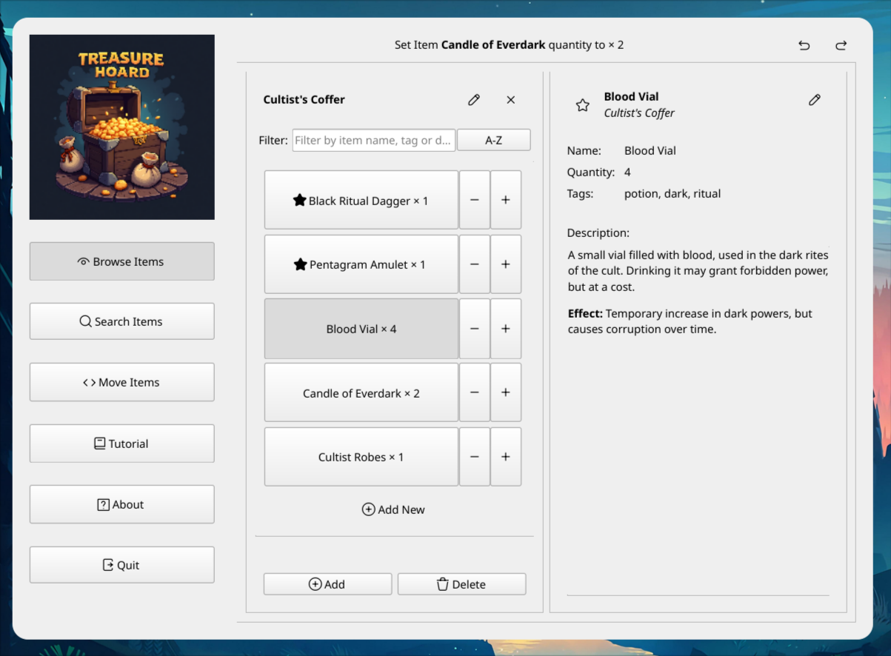

#Ohjelmointi 4 - Auli Jussila & Mikko Memonen

##Treasure Hoard!



Pieni ohjelma pöytäroolipelaamisen monimutkaistamiseksi.
Näillä ohjeilla saa tämän ehkä rakennettua.

## Lähtövaatimuksia
Näistä mielellään uusimmat versiot.
- Qt6
- cmake
- gcc (linux)
- mingw (win)


## Käyttäminen Linuxilla
Näin lähtee ainakin omalla Archilla.

1. Aloita juuresta, luo kansio build ja siirry sinne.
```
cd o4_project
mkdir build
```

2. Luo makefilet Cmakella.
```
cmake ..
```

3. Siirry takaisin juureen, käännä cmakella ja aja ohjelma.
```
cd ..
cmake --build build
./build/o4_project
```

## Käyttäminen Windowsilla
Näin lähtee ainakin omalla Windowsilla.
Käytä Qt:n asennuksen mukana tulevaa komentoriviä.
Käynnistä valikosta löytyy jotain: "Qt 6.9.0 (MinGW 13.1.0 64-bit)".

1. Aloita juuresta, luo kansio build ja siirry sinne.
```
cd o4_project
mkdir build
```

2. Luo makefilet Cmakella ja käännä MinGW:llä. 
```
cmake -G "MinGW Makefiles" ..
mingw32-make
```

3. Siirry takaisun juureen ja aja ohjelma.
```
cd ..
.\build\o4_project
```

